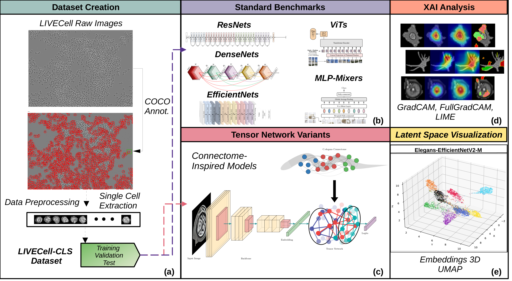
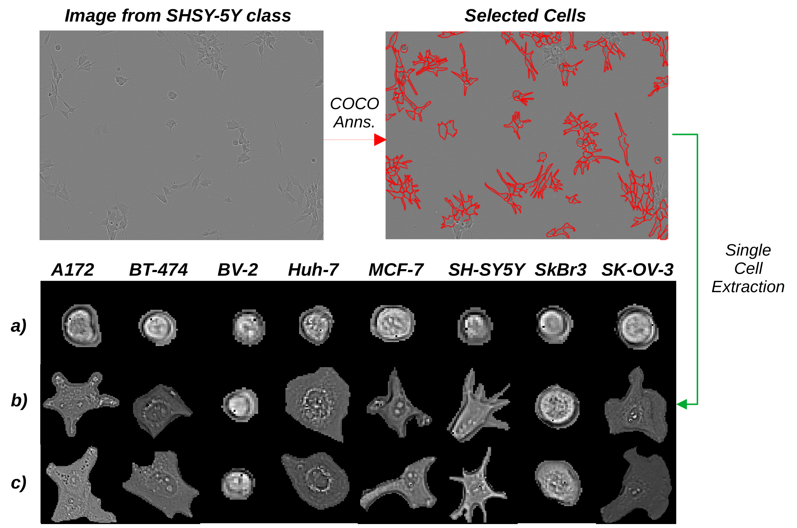
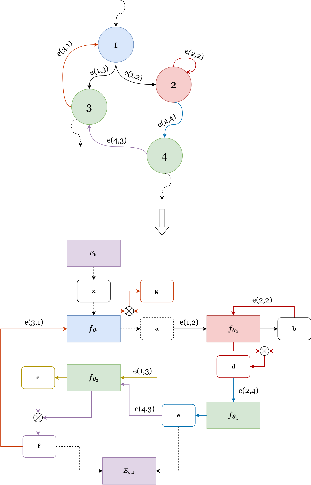
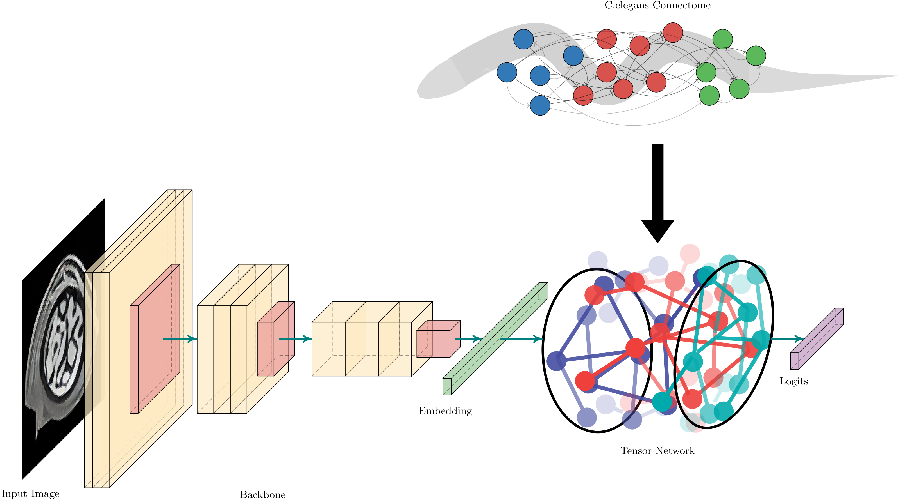

<p align="center">
    
</p>

<h1 align="center">
    Advancing Label-Free Cell Classification with Connectome-Inspired Explainable Models and a novel LIVECell-CLS Dataset
</h1>

<p align="center">
  P. Fiore, A. Terlizzi, F. Bardozzo, P. Liò, R. Tagliaferri
</p>

<p align="center">
 <a href="#"></a>
 
</p>
<p align="center">
 <a href="#"></a>
 <a href="#"></a>
</p>




# Table of Contents 
1. [Introduction](#introduction)
2. [LIVECell-CLS Dataset](#livecell-cls-dataset)
3. [Models](#models)
   - [Baselines](#baselines)
   - [Elegans AI Framework](#elegans-ai-framework)
   - [Connectome-Inspired Model Variants](#connectome-inspired-model-variants)
4. [Results](#results)
5. [Models' Weights](#models-weights)
6. [Installation Guide](#installation-guide)
   - [Installing Python](#installing-python)
   - [Cloning the Repository](#cloning-the-repository)
   - [Creating the Virtual Environment](#creating-the-virtual-environment)
   - [Installing Requirements](#installing-requirements)
7. [Getting to know the Model](#getting-to-know-the-model)
   - [Training](#training)
   - [Evaluation](#evaluation)
8. [Acknowledgements and references](#acknowledgements-and-references)  

# Introduction

Deep learning for label-free cell imaging has become a cornerstone of modern medical and biological research; however, creating robust and generalizable models for these tasks demands large-scale datasets.

To address this, we present **LIVECell-CLS**, the largest benchmark dataset for label-free cell classification, featuring over **1.6 million images across 8 distinct cell lines**. This dataset establishes a new standard for evaluating and advancing deep learning models in the field. Alongside LIVECell-CLS, we provide a comprehensive analysis of 14 state-of-the-art architectures, including CNNs, Vision Transformers (ViTs), and MLP-Mixers, revealing that CNN-based models consistently outperform other approaches in balanced accuracy and F1-score. 

To further enhance performance, we introduce Tensor Network variants inspired by the *C. elegans* connectome, which improve latent feature representations and achieve up to 4% gains in test accuracy with minimal parameter overhead. Our top-performing model, Elegans-EfficientNetV2-M, achieves 90.35% test accuracy and 94.82% F1-score, setting a new benchmark for label-free cell classification. 

Additionally, using Explainable AI techniques and UMAP visualizations, we provide insights into how these models process cell image data, highlighting improved feature separability and decision-making precision, especially for morphologically similar cell lines. This repository includes the LIVECell-CLS dataset, pre-trained models, and tools to facilitate reproducibility and further research in this domain.

# LIVECell-CLS Dataset


LIVECell-CLS is a  dataset specifically designed for label-free cell classification, derived from the LIVECell segmentation dataset. It features 1,686,352 single-cell images extracted from eight diverse cell lines, making it the largest publicly available dataset of its kind. The dataset retains the pre-defined train, validation, and test splits of the original LIVECell dataset for consistency, offering a robust foundation for benchmarking and developing machine learning models.

Other than its scale, LIVECell-CLS inherits from LIVECell a wide range of cell morphologies, temporal diversity across three days of imaging, and varying culture densities. This provides a more comprehensive and challenging benchmark compared to smaller datasets, and offers insights into the progression of cellular behaviors. Individual cells were isolated using COCO-format annotations, with backgrounds replaced by a black fill to ensure models focus on cell morphology alone. Standardized preprocessing, including resizing and zero-padding, is applied to uniform the cell images.

The above picture describes the the process in which single-cell images are extracted from the LIVECell ones using the COCO annotations. The images are from eight cell lines (A172, BT-474, BV-2, Huh7, MCF7, SH-SY5Y, SkBr3, SK-OV-3) showcase inter-class and intra-class variability between the three days of imaging. Rows highlight increasing inter-class differences: (a) minimal variability with mostly rounded shapes, (b) distinct morphological traits like elongation, and (c) irregular, atypical structures. Intra-class consistency remains high, but Row (c)'s irregularity complicates classification due to potential class overlaps.

# Models 

## Baselines
We evaluate standard deep learning architectures for single-cell classification, including ResNet and DenseNet for efficient feature reuse, EfficientNet/EfficientNetV2 for parameter-efficient scaling, and Vision Transformers (ViTs) for global context modeling. MLP-Mixer offers a lightweight alternative, while hybrid ResNet-ViT models combine CNNs' local feature extraction with Transformers' global attention, exemplified by ResNet18-ViT-B/1 and ResNet101-ViT-B/1.

## Elegans-AI Framework
<p align="center"></p>
Elegans-AI is a connectomic deep learning framework is a connectomic deep learning inspired by the _C.elegans_ neural connectome. It leverages an encoder-decoder architecture with a Tensor Network core to replicate the biological network's topology. The encoder maps inputs into a latent space, while the TN, structured like an input graph (e.g. the _C.elegans_ connectome), processes inputs via sensor, interneuron, and motor nodes, each modeled as trainable tensor units. These units integrate incoming signals and update states, enabling recurrent dynamics for robust signal propagation. The decoder transforms outputs into task-specific formats. This structure provides high expressivity and integrates seamlessly with deep learning workflows. Above, the picture shows an illustrative example of the tensor network algorithm applied to convert a small graph into a differentiable model. Sensor neurons, interneurons, and motor neurons, along with their respective tensor units, are depicted in blue, red, and green, respectively.

## Connectome-Inspired Model Variants

Tensor Network variants extend the Elegans-AI framework by integrating modules derived from various graph structures into existing deep learning architectures like ResNet, ViT, MLP-Mixer, DenseNet, and EfficientNetV2. As shown by the above image, these models replace traditional fully connected heads with TN modules constructed either from the _C.elegans_ connectome (i.e. Elegans variants, e.g. Elegans-ResNet, Elegans-ViT, ...) or from stochastic graphs generated using algorithms like Barabási-Albert (BA variants), Erdős-Rényi (ER variants), and Watts-Strogatz (WS variants). This design explores how different topologies affect model performance. The Tensor Network module operates post-pooling or post-attention, processing embeddings with minimal additional parameters (~20M for a 512-dimension vector) while potentially offering increased representational power. The _C.elegans_ connectome, being sparse, incurs lower computational costs compared to denser stochastic graphs, while retaining biologically inspired efficiency. This modular approach provides a flexible and scalable way to augment diverse architectures.

# Results 

# Model's Weights

# Installation Guide 

To install the necessary requirements for the project, please follow the steps below.

## Installing Python
Verify you have Python installed on your machine. The project is compatible with Python `3.9` or higher.

If you do not have Python installed, please refer to the official [Python Guide](https://www.python.org/downloads/).
## Creating the Virtual Environment 
It's strongly recommended to create a virtual environment for the project and activate it before proceeding. 
Feel free to use any Python package manager to create the virtual environment. However, for a smooth installation of the requirements we recommend you use `pip`. Please refer to [Creating a virtual environment](https://packaging.python.org/en/latest/guides/installing-using-pip-and-virtual-environments/#creating-a-virtual-environment).

_You may skip this step, but please keep in mind that doing so **could potentially lead to conflicts** if you have other projects on your machine_. 

## Cloning the Repository 
To clone this repository, download and extract the `.zip` project files using the `<Code>` button on the top-right or run the following command in your terminal:
```shell 
git clone https://github.com/NeuRoNeLab/remote-sensing-captioning-transformer.git
```

## Installing Requirements
To install the requirements, please: 
1. Make sure you have **activated the virtual environment where you installed the project's requirements**. If activated, your terminal, assuming you are using **bash**, should look like the following: ``(name-of-your-virtual-environment) user@user path``

2. Install the project requirements using `pip`:
```shell 
pip install -r requirements.txt
```

# Getting to know the Model

## Training 

## Evaluation


# Acknowledgements and references
