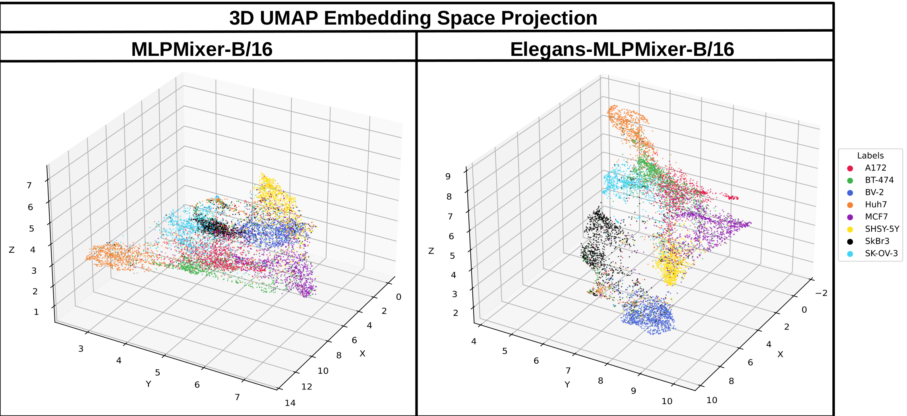

<p align="center">
    
</p>

<h1 align="center">
    Advancing Label-Free Cell Classification with Connectome-Inspired Explainable Models and a novel LIVECell-CLS Dataset
</h1>

<p align="center">
  P. Fiore, A. Terlizzi, F. Bardozzo, P. Liò, R. Tagliaferri
</p>


<p align="center">
 <a href="#"></a>
 
</p>
<p align="center">
 <a href="#"></a>
 <a href="#"></a>
</p>


# Table of Contents 
1. [Introduction](#introduction)
2. [LIVECell-CLS Dataset](#livecell-cls-dataset)
3. [Models](#models)
   - [Baselines](#baselines)
   - [Elegans AI Framework](#elegans-ai-framework)
   - [Connectome-Inspired Model Variants](#connectome-inspired-model-variants)
4. [Results](#results)
   - [Classification Benchmark](#classification-benchmark)
   - [Embedding Space Visualization](#embedding-space-visualization)
   - [XAI Analysis](#xai-analysis)
5. [Models' Weights](#models-weights)
6. [Installation Guide](#installation-guide)
   - [Installing Python](#installing-python)
   - [Cloning the Repository](#cloning-the-repository)
   - [Creating the Virtual Environment](#creating-the-virtual-environment)
   - [Installing Requirements](#installing-requirements)
7. [Getting to know the Model](#getting-to-know-the-model)
   - [Training](#training)
   - [Test Evaluation](#test-evaluation)
   - [XAI Evaluation](#xai-evaluation)
8. [Acknowledgements and references](#acknowledgements-and-references)  

# Introduction

Deep learning for label-free cell imaging has become a cornerstone of modern medical and biological research; however, creating robust and generalizable models for these tasks demands large-scale datasets.

To address this, we present **LIVECell-CLS**, the largest benchmark dataset for label-free cell classification, featuring over **1.6 million images across 8 distinct cell lines**. This dataset establishes a new standard for evaluating and advancing deep learning models in the field. Alongside LIVECell-CLS, we provide a comprehensive analysis of 14 state-of-the-art architectures, including CNNs, Vision Transformers (ViTs), and MLP-Mixers, revealing that CNN-based models consistently outperform other approaches in balanced accuracy and F1-score. 

To further enhance performance, we introduce Tensor Network variants inspired by the *C. elegans* connectome, which improve latent feature representations and achieve up to 4% gains in test accuracy with minimal parameter overhead. Our top-performing model, Elegans-EfficientNetV2-M, achieves 90.35% test accuracy and 94.82% F1-score, setting a new benchmark for label-free cell classification. 

Additionally, using Explainable AI techniques and UMAP visualizations, we provide insights into how these models process cell image data, highlighting improved feature separability and decision-making precision, especially for morphologically similar cell lines. This repository includes the LIVECell-CLS dataset, pre-trained models, and tools to facilitate reproducibility and further research in this domain.

# LIVECell-CLS Dataset


LIVECell-CLS is a  dataset specifically designed for label-free cell classification, derived from the LIVECell segmentation dataset. It features 1,686,352 single-cell images extracted from eight diverse cell lines, making it the largest publicly available dataset of its kind. The dataset retains the pre-defined train, validation, and test splits of the original LIVECell dataset for consistency, offering a robust foundation for benchmarking and developing machine learning models.

Other than its scale, LIVECell-CLS inherits from LIVECell a wide range of cell morphologies, temporal diversity across three days of imaging, and varying culture densities. This provides a more comprehensive and challenging benchmark compared to smaller datasets, and offers insights into the progression of cellular behaviors. Individual cells were isolated using COCO-format annotations, with backgrounds replaced by a black fill to ensure models focus on cell morphology alone. Standardized preprocessing, including resizing and zero-padding, is applied to uniform the cell images.

The above picture describes the the process in which single-cell images are extracted from the LIVECell ones using the COCO annotations. The images are from eight cell lines (A172, BT-474, BV-2, Huh7, MCF7, SH-SY5Y, SkBr3, SK-OV-3) showcase inter-class and intra-class variability between the three days of imaging. Rows highlight increasing inter-class differences: (a) minimal variability with mostly rounded shapes, (b) distinct morphological traits like elongation, and (c) irregular, atypical structures. Intra-class consistency remains high, but Row (c)'s irregularity complicates classification due to potential class overlaps.

The dataset is hosted on the [Kaggle platform](https://kaggle.com/datasets/4f9d6e01be82b388feb13f15ef781bd65142f59db3cd648061e8eccd01b850cf), where a tutorial notebook is also available.

# Models 

## Baselines
We evaluate standard deep learning architectures for single-cell classification, including ResNet and DenseNet for efficient feature reuse, EfficientNet/EfficientNetV2 for parameter-efficient scaling, and Vision Transformers (ViTs) for global context modeling. MLP-Mixer offers a lightweight alternative, while hybrid ResNet-ViT models combine CNNs' local feature extraction with Transformers' global attention, exemplified by ResNet18-ViT-B/1 and ResNet101-ViT-B/1.

## Elegans-AI Framework
<p align="center">
    
    
</p>
Elegans-AI is a connectomic deep learning framework is a connectomic deep learning inspired by the _C.elegans_ neural connectome. It leverages an encoder-decoder architecture with a Tensor Network core to replicate the biological network's topology. The encoder maps inputs into a latent space, while the TN, structured like an input graph (e.g. the _C.elegans_ connectome), processes inputs via sensor, interneuron, and motor nodes, each modeled as trainable tensor units. These units integrate incoming signals and update states, enabling recurrent dynamics for robust signal propagation. The decoder transforms outputs into task-specific formats. This structure provides high expressivity and integrates seamlessly with deep learning workflows. Above, the picture shows an illustrative example of the tensor network algorithm applied to convert a small graph into a differentiable model. Sensor neurons, interneurons, and motor neurons, along with their respective tensor units, are depicted in blue, red, and green, respectively.

## Connectome-Inspired Model Variants

Tensor Network variants extend the Elegans-AI framework by integrating modules derived from various graph structures into existing deep learning architectures like ResNet, ViT, MLP-Mixer, DenseNet, and EfficientNetV2. As shown by the above image, these models replace traditional fully connected heads with TN modules constructed either from the _C.elegans_ connectome (i.e. Elegans variants, e.g. Elegans-ResNet, Elegans-ViT, ...) or from stochastic graphs generated using algorithms like Barabási-Albert (BA variants), Erdős-Rényi (ER variants), and Watts-Strogatz (WS variants). This design explores how different topologies affect model performance. The Tensor Network module operates post-pooling or post-attention, processing embeddings with minimal additional parameters (~20M for a 512-dimension vector) while potentially offering increased representational power. The _C.elegans_ connectome, being sparse, incurs lower computational costs compared to denser stochastic graphs, while retaining biologically inspired efficiency. This modular approach provides a flexible and scalable way to augment diverse architectures.

# Results 

## Classification Benchmark
<p align="center">
    
</p>

CNN-based models consistently outperform ViTs and MLP-Mixer architectures in single-cell classification, with smaller architectures like ResNet18 and EfficientNet-B0 achieving balanced accuracies of 86.72% and 89.06%, respectively. These models also maintain high F1-scores (e.g., EfficientNet-B0 reaches 92.71%), outperforming ViT-B/32 (81.02% accuracy, 89.21% F1-score) despite its much larger parameter count. The observed trend highlights the effectiveness of CNNs in data-limited scenarios, where their inductive biases towards local feature extraction are advantageous. The Elegans-enhanced models introduce consistent performance gains across all architectures. For example, Elegans-EfficientNetV2-M achieves a test accuracy of 90.35% and an F1-score of 94.82%, improving over its baseline by nearly 1%. Similarly, Elegans-ResNet18 surpasses ResNet101's performance while having significantly fewer parameters. This trend extends to other families, like DenseNet and MLP-Mixer, with Elegans variants consistently demonstrating higher accuracy and F1-scores compared to their baselines.

## Embedding Space Visualization
<p align="center">
    
    
</p>

UMAP visualizations of model embeddings highlight improved class separability in Elegans variants. EfficientNet-based models produce well-defined clusters, with Elegans-EfficientNetV2-M enhancing separability further. For example, clusters for cell types such as A172 and Huh-7 are more distinct, demonstrating better feature extraction. Elegans-MLP-Mixer-B/16, while starting from a less effective baseline, exhibits one of the highest gains in clustering quality, showing the TN’s impact in improving even weaker models.

## XAI Analysis
<p align="center">
    
</p>

XAI visualizations align with numerical and embedding analysis. Elegans-enhanced models demonstrate more focused heatmaps, particularly on biologically critical regions like cell nuclei and shapes. For instance, GradCAM and LIME maps for Elegans-EfficientNetV2-M show precise feature attribution, improving upon the baseline’s often scattered and less informative attributions. In challenging cases like the shown SKOV-3 cell, the Elegans variant correctly classifies them with highly localized attention maps, while the baseline struggles, highlighting the Elegans model’s improved capacity for meaningful feature extraction. Even in failure scenarios, such as SHSY-5Y cells, the Elegans maps remain less dispersed, showcasing improved robustness.

# Model's Weights

# Installation Guide 

To install the necessary requirements for the project, please follow the steps below.

## Installing Python
Verify you have Python installed on your machine. The project is compatible with Python `3.9` or higher.

If you do not have Python installed, please refer to the official [Python Guide](https://www.python.org/downloads/).
## Creating the Virtual Environment 
It's strongly recommended to create a virtual environment for the project and activate it before proceeding. 
Feel free to use any Python package manager to create the virtual environment. However, for a smooth installation of the requirements we recommend you use `pip`. Please refer to [Creating a virtual environment](https://packaging.python.org/en/latest/guides/installing-using-pip-and-virtual-environments/#creating-a-virtual-environment).

_You may skip this step, but please keep in mind that doing so **could potentially lead to conflicts** if you have other projects on your machine_. 

## Cloning the Repository 
To clone this repository, download and extract the `.zip` project files using the `<Code>` button on the top-right or run the following command in your terminal:
```shell 
git clone https://github.com/NeuRoNeLab/remote-sensing-captioning-transformer.git
```

## Installing Requirements
To install the requirements, please: 
1. Make sure you have **activated the virtual environment where you installed the project's requirements**. If activated, your terminal, assuming you are using **bash**, should look like the following: ``(name-of-your-virtual-environment) user@user path``

2. Install the project requirements using `pip`:
```shell 
pip install -r requirements.txt
```

# Getting to know the Model
The experimental setup is based on the Lightning API, and employs the LightningCLI that manages the hyperparameter configurations through yaml files. The configuration of most of our baseline and proposed architectures are provided in the ```_configs``` directory. Of course, specific directory paths and logging informations need to be updated in order to be used on any machine.

## Logging
By default, the Weights & Biases (WandB) platform is used to track the experiments, which needs you to have an account and be logged in it on your machine. This is done by the following command (which later requires you to input your username and private API key):

```shell 
python wandb login
```
Refer to the [WandB site](https://wandb.ai/site) for more information.

In each configuration yaml file, you can update the logging settings (including, most importantly, the name of the project) by modifying the ```logger``` field values according to your preferences. You can also replace WandB logging by replacing the logging fields with the default ```CSVLogger``` or disable logging entirely by setting ```logger``` to ```null```. You can also customize the model settings according to your preferences (reference the code documentation for a detailed explaination of each field).

## Training
To train a model, find the corresponding CLI script (e.g. ```backbone_cli.py```, ```elegans_vision_cli.py```, ...), and the desired yaml configuration file (e.g. ```densenet161.yaml```, ```elegans_efficientnetv2m.yaml```, ...), then start the training with the LightningCLI. 

For baseline CNN models like ResNet, DenseNet, and EfficientNetV2 (e.g. ```resnet18.yaml```, ```densenet161.yaml```, ```efficientnetv2_s.yaml```):

```shell 
python backbone_cli.py fit --config <yourconfig>.yaml
```

For baseline ViT models (e.g. ```custom_vit_b32_livecell.yaml```, ```custom_vit_b16_livecell.yaml```):

```shell 
python custom_vit_cli.py fit --config <yourconfig>.yaml
```

For baseline MLP-Mixer models (e.g. ```mlpmixer_b32_livecell.yaml```, ```mlpmixer_b16_livecell.yaml```):

```shell 
python mlpmixer_cli.py fit --config <yourconfig>.yaml
```
For ResNet-ViT models (e.g. ```resnet101-vit-b1.yaml```):

```shell 
python backbone_vit_cli.py fit --config <yourconfig>.yaml
```

For Elegans variants of CNN models like Elegans-ResNet, Elegans-DenseNet, and Elegans-EfficientNetV2 (e.g. ```elegans_resnet18.yaml```, ```elegans_densenet161.yaml```, ```elegans_efficientnetv2_s.yaml```):

```shell 
python elegans_vision_cli.py fit --config <yourconfig>.yaml
```

For Elegans-ViT models (e.g. ```elegansformer_b32_livecell.yaml```, ```elegansformer_b16_livecell.yaml```):

```shell 
python elegansformer_cli.py fit --config <yourconfig>.yaml
```
For Elegans-MLP-Mixer models (e.g. ```elegansmlpmixer_b32_livecell.yaml```, ```elegansmlpmixer_b16_livecell.yaml```):

```shell 
python elegansmlpmixer_cli.py fit --config <yourconfig>.yaml
```

## Test Evaluation
To evaluate a model on the LIVECell-CLS test set, find the corresponding CLI script (e.g. ```backbone_cli.py```, ```elegans_vision_cli.py```, ...), and the desired yaml configuration file (e.g. ```densenet161.yaml```, ```elegans_efficientnetv2m.yaml```, ...), then start the inference with the LightningCLI. 

For baseline CNN models like ResNet, DenseNet, and EfficientNetV2 (e.g. ```resnet18.yaml```, ```densenet161.yaml```, ```efficientnetv2_s.yaml```):

```shell 
python backbone_cli.py test --config <yourconfig>.yaml
```

For baseline ViT models (e.g. ```custom_vit_b32_livecell.yaml```, ```custom_vit_b16_livecell.yaml```):

```shell 
python custom_vit_cli.py test --config <yourconfig>.yaml
```

For baseline MLP-Mixer models (e.g. ```mlpmixer_b32_livecell.yaml```, ```mlpmixer_b16_livecell.yaml```):

```shell 
python mlpmixer_cli.py test --config <yourconfig>.yaml
```
For ResNet-ViT models (e.g. ```resnet101-vit-b1.yaml```):

```shell 
python backbone_vit_cli.py test --config <yourconfig>.yaml
```

For Elegans variants of CNN models like Elegans-ResNet, Elegans-DenseNet, and Elegans-EfficientNetV2 (e.g. ```elegans_resnet18.yaml```, ```elegans_densenet161.yaml```, ```elegans_efficientnetv2_s.yaml```):

```shell 
python elegans_vision_cli.py test --config <yourconfig>.yaml
```

For Elegans-ViT models (e.g. ```elegansformer_b32_livecell.yaml```, ```elegansformer_b16_livecell.yaml```):

```shell 
python elegansformer_cli.py test --config <yourconfig>.yaml
```
For Elegans-MLP-Mixer models (e.g. ```elegansmlpmixer_b32_livecell.yaml```, ```elegansmlpmixer_b16_livecell.yaml```):

```shell 
python elegansmlpmixer_cli.py test --config <yourconfig>.yaml
```

## XAI Evaluation
The ```explainability_livecell_cli.py``` can be used to apply various explainability techniques (e.g., GradCAM, LIME, attention maps), analyzing baseline and tensor network-enhanced models introduced in our work. Below is a quick guide to execute the script and configure its parameters. 

The script can be run with the following command:

```shell
python explainability_livecell_cli.py --config <yourconfig>.yaml [options]
```

The argument options can be configured according to the following table:

| Argument             | Type    | Default           | Description                                                                                     |
|----------------------|---------|-------------------|-------------------------------------------------------------------------------------------------|
| `--config`           | `str`   | `config.yaml`     | Path to the Lightning CLI YAML configuration file for the model and data.                      |
| `--model_type`       | `str`   | `vit`             | Type of model to analyze. Options: `vit`, `visionbackbone`, `elegansformer`, `visionelegans`, `mlpmixer`, `elegansmlpmixer`, `backbonevit`. |
| `--model_name`       | `str`   | `model`           | Name to identify the model in outputs.                                                         |
| `--ckpt_path`        | `str`   | `None`            | Path to the model checkpoint file.                                                             |
| `--target_layer_names` | `str` | `None`            | Names of target layers for GradCAM methods (space-separated list).                            |
| `--methods`          | `str`   | `gradcam`         | Explainability techniques to apply. Options include GradCAM variants, LIME, and attention maps. (See below for all options.)     |
| `--eigen_smooth`     | `bool`  | `True`            | Use eigen-smooth for GradCAM methods.                                                         |
| `--aug_smooth`       | `bool`  | `True`            | Use augmentation smoothing for GradCAM methods.                                               |
| `--reshape_height_vit` | `int` | `16`              | Height of the latent image for ViT-like models in GradCAM methods.                            |
| `--reshape_width_vit` | `int` | `16`              | Width of the latent image for ViT-like models in GradCAM methods.                             |
| `--plot_imgs`        | `bool`  | `False`           | Whether to display generated images during execution.                                          |
| `--return_masked_img` | `str` | `all`             | Specify which attention-masked images to return: `all`, `last`, `mean`.                        |
| `--img_paths`        | `str`   | `example.png`     | Path(s) to input images (space-separated list).                                                |
| `--out_dir`          | `str`   | `_explainability` | Directory for output files.                                                                    |
| `--device`           | `str`   | `cuda`/`cpu`      | Device to use for inference.                                                                   |
| `--image_weight`     | `float` | `0.5`             | Weight for overlaying the explainability map on the image.                                      |

Specify one or more GradCAM methods using the `--methods` parameter. At the moment, the following are supported:

- `gradcam` ([GradCAM](https://arxiv.org/abs/1610.02391))
- `xgradcam` ([XGradCAM](https://arxiv.org/abs/2008.02312v4))
- `gradcampp` ([GradCAM++](https://arxiv.org/abs/1710.11063))
- `gradcamelementwise` ([Element-Wise GradCAM](https://doi.org/10.1609/aaai.v35i3.16344))
- `eigencam` ([Eigen-CAM](https://arxiv.org/abs/2008.00299))
- `eigengradcam` ([Eigen-GradCAM](https://jacobgil.github.io/pytorch-gradcam-book/introduction.html))
- `fullgradcam` ([Full-Grad](https://arxiv.org/abs/1905.00780))
- `hirescam` ([HiResCAM](https://arxiv.org/abs/2011.08891))
- `layercam` ([LayerCAM](https://ieeexplore.ieee.org/document/9462463))
- `scorecam` ([Score-CAM](https://arxiv.org/abs/1910.01279))
- `randomcam` ([RandomCAM](https://jacobgil.github.io/pytorch-gradcam-book/introduction.html))
- `ablationcam` ([AblationCAM](https://openaccess.thecvf.com/content_WACV_2020/papers/Desai_Ablation-CAM_Visual_Explanations_for_Deep_Convolutional_Network_via_Gradient-free_Localization_WACV_2020_paper.pdf))

Other explainability methods include:
- `attentionmap` (for attention-based models, based on [Attention Rollouts](https://arxiv.org/abs/2005.00928))
- `lime` ([Local Interpretable Model-Agnostic Explanations](https://arxiv.org/abs/1602.04938))

Here is an example:

```shell
python explainability_livecell_cli.py \
  --config config.yaml \
  --model_type vit \
  --ckpt_path checkpoints/model.ckpt \
  --target_layer_names layer1 layer2 \
  --methods gradcam attentionmap \
  --img_paths example1.png example2.png \
  --out_dir results \
  --device cuda
```
Results (e.g., explainability maps) are saved in the specified `--out_dir`, organized by model type and name. Subfolders contain maps for each explainability method.

# Acknowledgements and references
We sincerely thank the authors of the original [LIVECell dataset](https://doi.org/10.1038/s41592-021-01249-6) (Edlund, Christoffer, et al. "LIVECell—A large-scale dataset for label-free live cell segmentation." Nature methods 18.9 (2021): 1038-1045.) for providing the data to construct the LIVECell-CLS dataset.

Furthermore, we acknowledge the author of the [pytorch-grad-cam](https://github.com/jacobgil/pytorch-grad-cam) repository, which our XAI code was based upon.


